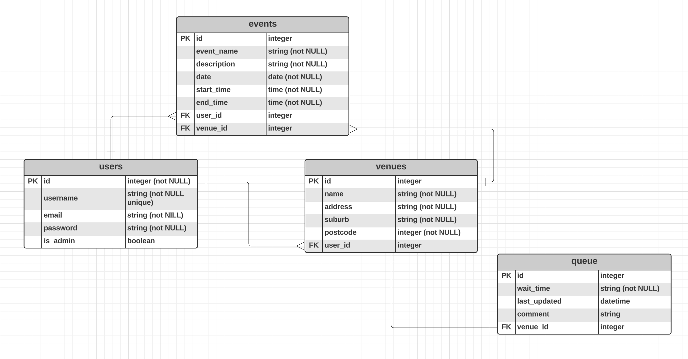

# Venue Queues API

### R1 - Identification of the problem you are trying to solve by building this particular app.

Have you ever booked an Uber to a venue for a night out only to get there and see a long spannning queue that doesn't seem to be moving? Then you realise that you don't want to spend your time waiting in the qeueue as you need to get home and continue working on building application(s). The next best venue another Uber ride away, but you don't know if the queue is any better there. You decide to go there anyway, only to find that the queue is even longer than the previous venue. You end up calling it a night after wastiing your time and money. On the way home, you think to yourself, "If only there was a way to know how long the queue was before I got there, I could have saved myself a lot of time and effort."

This application seeks to solve the problem of lack of transparency and real-time information about nightclub, bar, and venue queues. Currently, individuals often have to physically visit a venue to assess the queue length, wasting time, money, and effort, especially during peak times. Additionally, information about upcoming events and venue details may be scattered across various sources, making it difficult to plan a night out efficiently. This application will provide a centralised source of information about venues, including queue length, upcoming events, and venue details, allowing users to plan their night out more efficiently.

___

### R2 - Why is it a problem that needs solving?

This lack of transparency and information presents several significant problems:

- Wasted Resrouces: Individuals spend valuable time waiting in lines, sometimes for longer than anticipated, without knowing the actual queue length. This leads to frustration, waster resource, and an overall poor experience.

- Difficulty in Planning: Uncertain queue lengths make it difficult to plan outings effectively. Individuals may arrive at a venue too early or miss out on popular events due to inaccurate information.

- Missed Opportunities: Lack of awareness of upcoming events and venue details can lead to missed opportunities for individuals to enjoy specific events or discover new venues.

- Inefficient Venue Management: Venues lack real-time data on their queue lengths, hindering their ability to effectively manage crowd flow and optimise their operations.

Therefore, the problem of lack of transparency and information about nightclub and venue queues is a significant issue that negatively impacts both users and businesses. This application provides a valuable solution by offering real-time data and facilitating informed decision-making, leading to a more enjoyable and efficient nightlife experience for all.
___

### R3 - Why have you chosen this database system. What are the drawbacks compared to others?

___

### R4 - Identify and discuss the key functionalities and benefits of an ORM

___

### R5 - Document all endpoints for your API

___

### R6 - An ERD for your app

This is the inital version of the Entity Relationship Diagram for my application.

___

### R7 - Detail any third party services that your app will use

___

### R8 - Describe your projects models in terms of the relationships they have with each other

___

### R9 - Discuss the database relations to be implemented in your application

___

### R10 - Describe the way tasks are allocated and tracked in your project